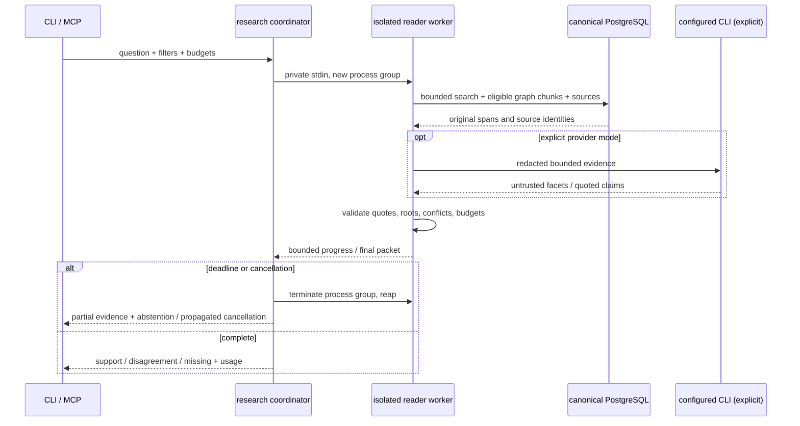

# Bounded research: design and as-built boundary

Question: how do hard deadlines, source provenance and privacy coexist without changing ordinary search?

AF-5.6-01: parent wall deadline covers nested network/SQL/provider stalls and scope resolution. AF-5.6-02: exact quotes count distinct qualified upstream source keys per statement, not chunks. AF-5.6-03: graph endpoints retain domain/project/time/active filters; evidence hydration checks sources separately. Relevant candidates are ranked across the whole document before the shared64-chunk cap. Success flow: compound search → late graph chunk → exact citation. Recovery flow: stalled worker → group/temp cleanup → independent retry, no store/config change. Real process, CLI/MCP and gateway-based tests plus populated acceptance reconcile these flows; [verification](../verification/bounded-research.md) records results and remaining live rollout limits. Provider failure latches local abstention; model coverage is not a locally proven semantic fact.
