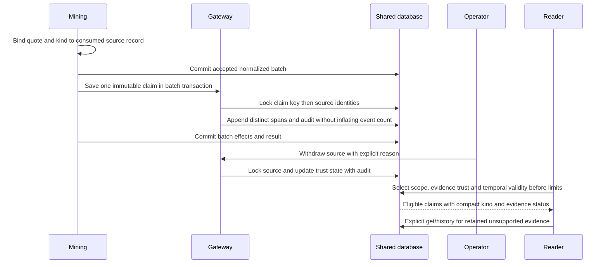

# Claim evidence lifecycle — as-built

Question: how can source withdrawal change current knowledge without destroying it?
Requirements: RAG-007 AC001–007, IC001–004. Sources: mining.py accepted batches,
mining_window.py consumed events, store.py/validity.py gateways, migration011 predicate.
Mermaid sequence; semantic source inspection 2026-09-06, rendering not claimed.

Crash before effects commit rolls back claims, source links and audits together;
accepted extraction remains replayable. Source withdrawal changes eligibility via
read-time joins, so other supporting sources remain untouched. Trust is current even
for as-of queries. Pins are independent. Legacy provenance remains explicitly incomplete.

Reconciliation 2026-09-06: review binds to active spans using claim_evidence.reviewed;
new attachments do not inherit confirmation. Source timestamps normalize independently
for old accepted temporal batches. Signal additions require quoted support. Summary
completeness tracks actual full-source flags. Tests cover insertion and source-state
audit rollback, concurrent withdrawal/attach, source-to-reader replay, pre-limit and
graph-hop eligibility. Semantic source inspection performed; no renderer claim.
