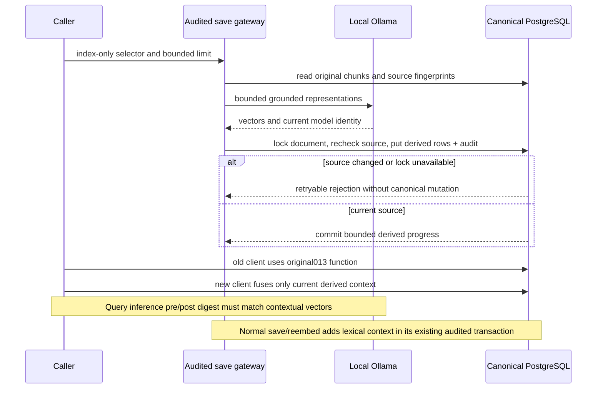

# Contextual indexing consistency

Question: how can a derived index be built concurrently while original citations and rollback remain valid? RAG-5.4 AC-002/004/006, IC-001/002. As-built,2026-10-03; evidence contextual.py refresh/source_rows, store.py save_document/reembed_document, search.py and sql015. Semantic Mermaid source review (no renderer installed).

Original chunks/vectors are never replaced by index-only calls. Normal old saves cascade-remove their own stale derived rows; raw baseline remains available. Missing015 and code rollback use original013 reads. Independent architect `/root/review_contextual` derived these executable integration scenarios; [rehearsal script](../../scripts/verify_contextual_indexing.py) and [results](../benchmarks/2026-10-03-contextual-indexing/results.json) cover them.

- Success: populated014→015, bounded audited CLI indexing, read-only scoped MCP, exact original citations and canonical fingerprints. Concurrent actual old/new readers continue on one store.
- Recovery: interrupt after one chunk, actual old writer corrects source/scope, resume, exclude original scope and stale context, verify old client/code rollback. Restore014 into a separate owned database and reupgrade with all original table fingerprints.

As-built reconciliation retained the source fingerprint/lock and side-table decisions. Query inference additionally binds pre/post model identity; normal queued reembedding rebuilds lexical contexts after FK cascade. These corrections close review findings without changing accepted intent. No new job, client setting or service boundary was added.
