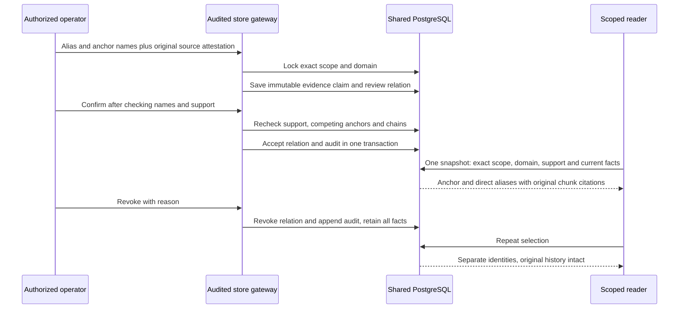

# Entity aliases: reversible evidence selection

Question: What changes when an alias is confirmed or revoked, and which evidence
can a reader traverse? Mode: as-built; reconciled2026-10-04 by semantic source
review and executed integration checks (no renderer dependency). Requirements: RAG-5.8 AC-001–008.
Evidence: spec/plan, entities.py, store.py, unchanged validity.py/evidence.py/db.py,
schema018 and [executed verification](../verification/entity-identities.md).

Supported upgrade: transactionally add018, repeat bounded gateway backfill, activate
approved code, reconnect selected clients. Old assertions remain exact-name visible
without attachments. DDL interruption rolls back; backfill interruption rolls back
only its unfinished batch. Code rollback leaves018. Full restore is a separate
operation whose data-loss limit is the backup snapshot.

## Derived integration checks

| ID / requirement | Success path | Recovery/failure path | Executed evidence / result |
| --- | --- | --- | --- |
| EI-S01 / AC-001/006 | Old017 facts and new old-client facts derive stable IDs; audited batches persist the same IDs | Optional018 absent, interrupted mapping and no-op retry preserve caller/original state |61 entity tests, populated017 candidate CLI/MCP, strict copy607 assertions: pass |
| EI-S02 / AC-002/003/007 | Explicit supported original span confirms one scope/domain star under lock | Competing anchor/chain, withdrawn bound source, later unreviewed support, foreign boundary withhold expansion | Entity trust/boundary/concurrency/privilege cases: pass |
| EI-S03 / AC-004/005/008 | Original chunks under both names, current later replacement and separately qualified history | Revocation separates identities; expired/withdrawn replacement never revives old current status; conflicts/limits withhold context | Entity history/revoke/limit tests and3 measured cases20 warm observations: pass |
| EI-S04 / AC-006/007 | Actual old/new overlapping shared-source processes and CLI/MCP9/15→10/18 | Retained commit=False mining batch and second-key writer keep original lock contracts | Real regressions plus3 source/new subprocess overlaps: pass |
| EI-R01 / AC-006 | Fresh source017 backup and target018 strict restore preserve table/grant inventories | Interrupted DDL rolls back; migration acknowledgement retry no-op | Main driver synthetic and private18-table copy: pass |
| EI-R02 / AC-006 | Guarded source017→018 gateway backfill and exact approved fast-forward | Wrong/dirty/imported candidate or pre/post-lock drift rejected; busy private lock retained | Literal PB activation driver: pass |
| EI-R03 / AC-006 | New read client and code activation preserve protected state | Source-code recovery retains018, prior branch tip and original citations; lock reacquires | Literal PB recovery plus source/new/source MCP: pass |

No derived integration gap remains. Production merge/adoption and long-lived
client reconnect are explicit later authority/observation boundaries, not inferred
from these isolated checks. Source raw assertion rows stay authoritative; no new
locking/effects are added to the existing assertion/mining transaction path.
