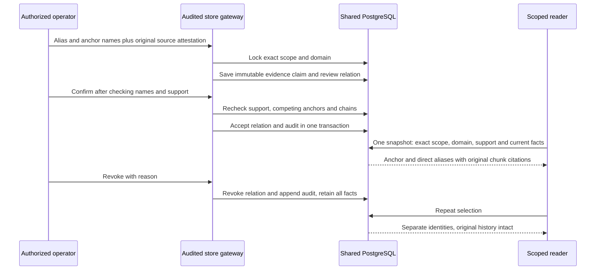

# Entity aliases: reversible evidence selection

Question: What changes when an alias is confirmed or revoked, and which evidence
can a reader traverse? Mode: design-time; verified2026-10-04 by semantic source
review (no renderer dependency). Requirements: RAG-5.8 AC-001–007.
Evidence: spec/plan, store.py, validity.py, evidence.py, db.py, schema001–017.

Supported upgrade: transactionally add018, repeat bounded gateway backfill, activate
approved code, reconnect selected clients. Old assertions remain exact-name visible
without attachments. DDL interruption rolls back; backfill interruption rolls back
only its unfinished batch. Code rollback leaves018. Full restore is a separate
operation whose data-loss limit is the backup snapshot.
