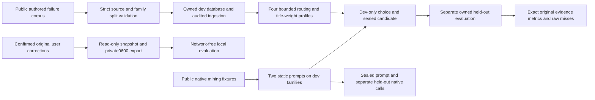

# RAG-5.10 architecture and findings

The candidate has no production loader. Public and private formats have separate entry
points; only built-in public mining fixtures can invoke the configured native provider.
Model/source/prompt identity checks invalidate mixed observations. Original write gateways
and existing scope/domain/time/claim gates remain authoritative.

Design findings II-01–06 are in the plan. Independent pre-execution review found candidate
hash-format incompatibility, missing run-level model/prompt identity guards and a schema-time
checkout drift window. Their fixes/regressions and final disposition are in verification.
The live schema remains018; Feature10 itself introduces no SQL. Combined019 adoption and
code-only recovery are measured on owned copies before handoff.
