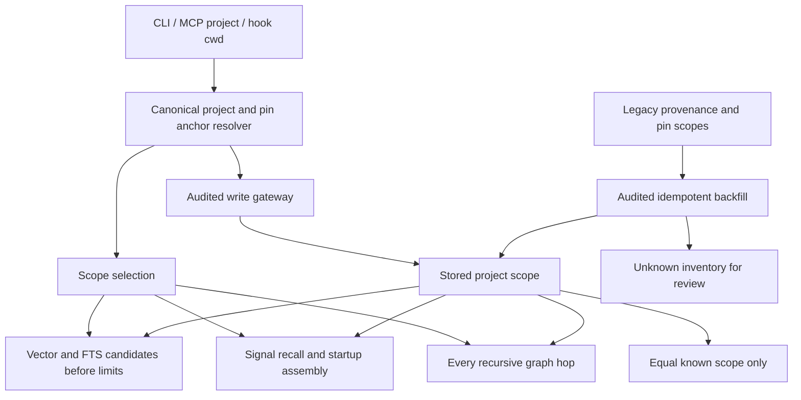

# Project scope selection (design and implementation contract)

Question: where must scope be enforced to prevent candidate-limit and graph bypass?
Requirements: RAG-005 AC-001..006. Evidence: search.py/003_search.sql,
004_graph.sql, store.py, mining.py, curation.py, hooks/*.py. Owner: coordinator.
Verification: 2026-09-05; Mermaid source inspected semantically, not rendered.

No auth boundary is added. Explicit get/path without selection stays a deliberate
cross-project browse. Profiles must consume Select when later implemented.
